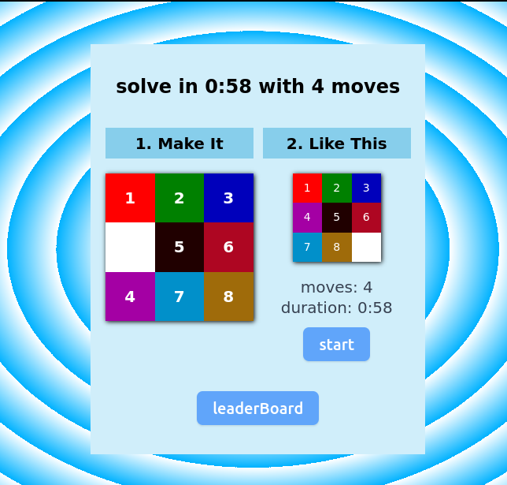

# SlideBoard9

SlideBoard9 is a puzzle game where you could move numbered squares to solve
with limited moves and time.

## project structure

- src/main.tsx : devvit-specific code. contians addCustomPostType
- src/createPost.tsx: devvit code to add menu items
- src/App.tsx: contains App component & webviews...
- src/webviewMsg.tsx: contains declaration of type which webview sends
- webroot: it contains the webView codes
